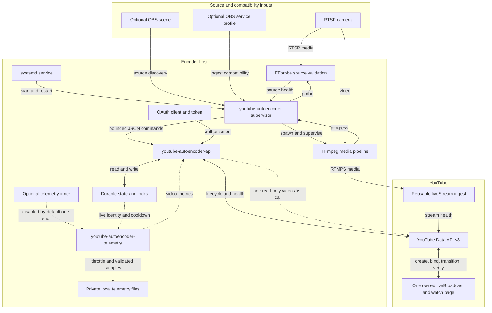
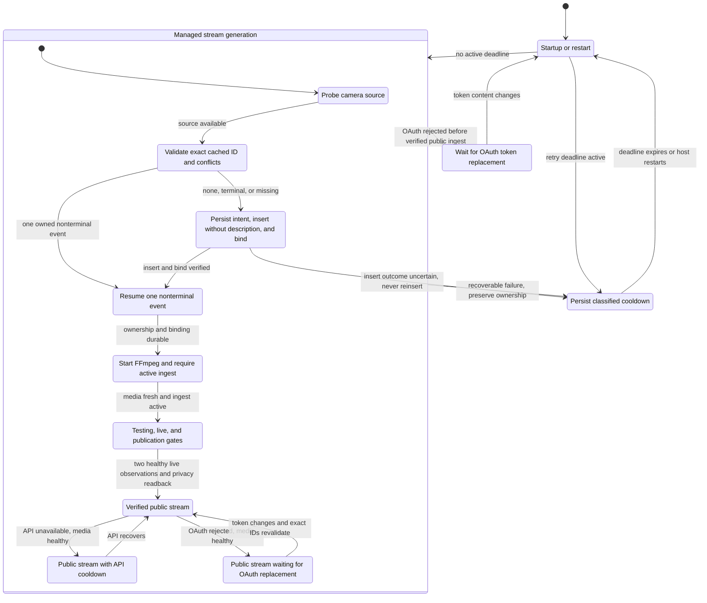
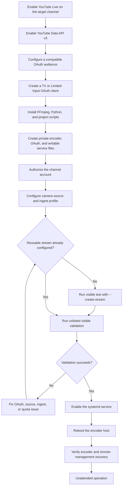

# Architecture and Operational Flows

This page collects the project's visual system and operational flows. Use the [README](../README.md) for installation commands, configuration, failure details, OAuth provisioning, and operations.

For reconciliation algorithms, lifecycle invariants, and test strategy, see the [idempotent lifecycle recovery design](superpowers/specs/2026-07-10-idempotent-youtube-lifecycle-design.md).

## System Architecture

The encoder separates local media supervision from serialized YouTube lifecycle control.

Dashed edges are the optional telemetry path. It reads durable lifecycle state, calls the existing OAuth-aware helper only for an eligible live broadcast, and stores private local snapshots. It has no edge back to the supervisor, FFmpeg, broadcast lifecycle, privacy, or recovery state.

Return to [Architecture](../README.md#architecture).

## Recovery State Machine

Recovery preserves ownership, retries through durable cooldowns, and replaces an event only after it is terminal or confirmed missing.

The helper never sets or updates YouTube descriptions. Schema-v3 state stores the exact broadcast ID and a write-ahead create fingerprint. A lost insert response enters `verify_create`; recovery may adopt exactly one normalized remote match, but zero or multiple matches stay blocked under durable ambiguous backoff. Cached access tokens rejected with HTTP 401 receive one refresh under a shared local `fcntl` lock and one exact buffered request replay. If that replay is also rejected, the supervisor waits on the post-refresh token fingerprint so its own token write cannot trigger a busy loop. Other OAuth rejection does not enter remote backoff: the service makes no further API calls until the private token file changes. Legacy description markers are read only for one-way schema-v2 migration.

Return to [Recovery Behavior](../README.md#recovery-behavior).

## Provisioning and Deployment

Provisioning validates YouTube, OAuth, ingest, and media before enabling unattended service operation.

Return to [Installation](../README.md#installation).
