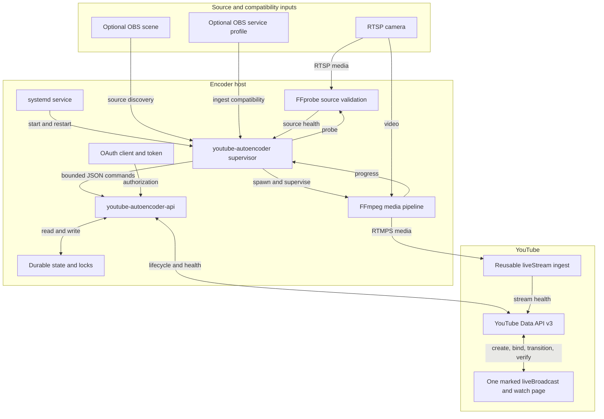
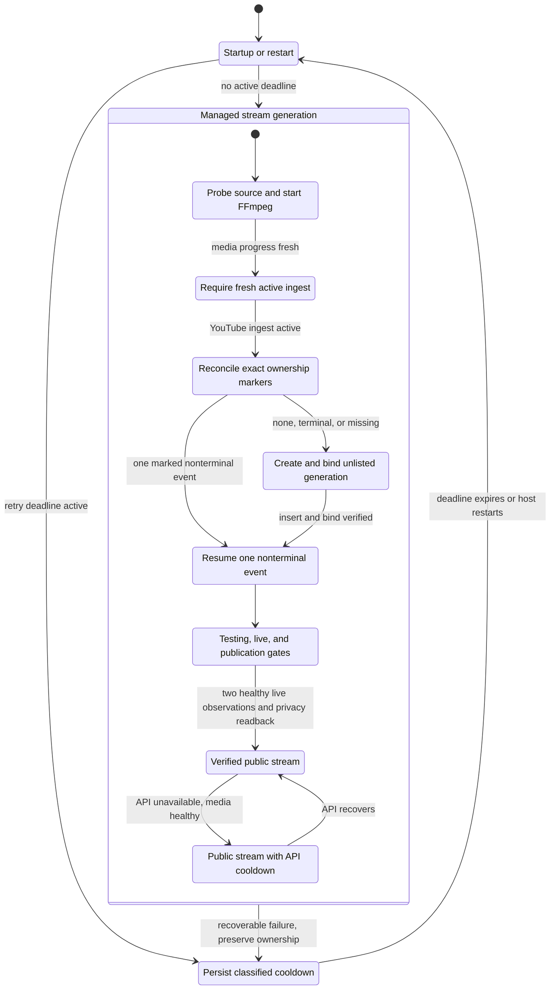
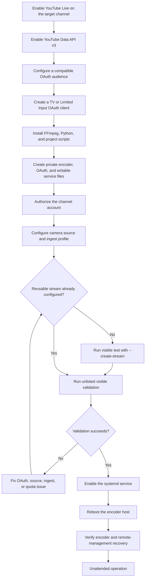

# README Architecture Diagrams Implementation Plan

> **For agentic workers:** REQUIRED SUB-SKILL: Use superpowers:subagent-driven-development (recommended) or superpowers:executing-plans to implement this plan task-by-task. Steps use checkbox (`- [ ]`) syntax for tracking.

**Goal:** Add three GitHub-native Mermaid diagrams to the README for a balanced audience of deployment operators and code contributors.

**Architecture:** Replace the current ASCII architecture sketch with a component flowchart, add a recovery-focused state machine before the recovery table, and add a provisioning/deployment flow before installation commands. Keep the detailed prose, OAuth guide, caveats, and latest-only changelog authoritative; diagrams summarize ownership and decisions without changing runtime behavior.

**Tech Stack:** GitHub Flavored Markdown, Mermaid, markdownlint-cli2, Mermaid CLI, Git, GitHub Actions.

## Global Constraints

- The README must contain exactly three Mermaid diagrams: system architecture, recovery state machine, and provisioning/deployment flow.
- Do not add a dedicated normal-production lifecycle diagram.
- Use GitHub-supported Mermaid syntax with stable alphanumeric IDs and quoted labels.
- Do not use custom themes, colors, HTML labels, icons, generated images, or external diagram assets.
- Do not include camera credentials, stream keys, OAuth values, deployment-specific IDs, or other secrets.
- Preserve the component table, persistent-state section, numbered production loop, recovery table, OAuth guide, caveats, and latest-only changelog entry.
- Do not modify runtime code, configuration, systemd units, release metadata, or runtime behavior.

---

### Task 1: Replace The ASCII Architecture Sketch

**Files:**

- Modify: `README.md:29-53`

**Interfaces:**

- Consumes: Component names and ownership boundaries documented in `README.md` and `docs/superpowers/specs/2026-07-10-idempotent-youtube-lifecycle-design.md`.
- Produces: One `flowchart TB` Mermaid block under `## Architecture`; later validation relies on its `ArchitectureInputs`, `ArchitectureHost`, and `ArchitectureYouTube` subgraph IDs.

- [ ] **Step 1: Verify the three-diagram contract currently fails**

Run:

```bash
test "$(rg -c '^```mermaid$' README.md)" -eq 3
```

Expected: nonzero exit because the current README contains no Mermaid blocks.

- [ ] **Step 2: Replace the ASCII block with the architecture diagram**

Keep the existing introductory and ownership paragraphs. Replace only the fenced `text` diagram with:



After the ownership paragraph, add this implementation-depth pointer:

```markdown
For the detailed reconciliation algorithm, lifecycle states, and test strategy, see the [idempotent lifecycle recovery design](docs/superpowers/specs/2026-07-10-idempotent-youtube-lifecycle-design.md).
```

- [ ] **Step 3: Validate the architecture block**

Run:

```bash
test "$(rg -c '^```mermaid$' README.md)" -eq 1
rg -n 'ArchitectureInputs|ArchitectureHost|ArchitectureYouTube|bounded JSON commands' README.md
git diff --check
```

Expected: one Mermaid block, all four identifiers found, and zero diff-check errors.

- [ ] **Step 4: Commit the architecture diagram**

```bash
git add README.md
git commit -S -m "docs: diagram encoder architecture"
```

### Task 2: Add The Recovery State Machine

**Files:**

- Modify: `README.md` under `### Recovery Behavior`, before the failure table.

**Interfaces:**

- Consumes: Retry classes, reconciliation rules, and public fallback behavior already documented in the recovery prose and table.
- Produces: One `stateDiagram-v2` Mermaid block using recovery state aliases prefixed with `Recovery`.

- [ ] **Step 1: Confirm the recovery diagram is absent**

Run:

```bash
test "$(rg -c '^stateDiagram-v2$' README.md)" -eq 0
```

Expected: exit 0 before the diagram is added.

- [ ] **Step 2: Insert the recovery orienting paragraph and state machine**

Immediately after `### Recovery Behavior`, add:

````markdown
Every recovery path first preserves ownership and retry state. Media must be fresh and YouTube ingest active before reconciliation can create or transition anything.


````

- [ ] **Step 3: Validate recovery coverage without adding a production lifecycle diagram**

Run:

```bash
test "$(rg -c '^```mermaid$' README.md)" -eq 2
test "$(rg -c '^stateDiagram-v2$' README.md)" -eq 1
rg -n 'RecoveryBackoff|RecoveryPublicFallback|preserve ownership|none, terminal, or missing' README.md
! rg -n '^### (Production Lifecycle Diagram|Normal Lifecycle Diagram)$' README.md
git diff --check
```

Expected: two total Mermaid blocks, one state diagram, all recovery identifiers found, no forbidden lifecycle-diagram heading, and zero diff-check errors.

- [ ] **Step 4: Commit the recovery state machine**

```bash
git add README.md
git commit -S -m "docs: diagram lifecycle recovery"
```

### Task 3: Add The Provisioning And Deployment Flow

**Files:**

- Modify: `README.md` at the start of `## Installation`, before `Install runtime packages:`.

**Interfaces:**

- Consumes: Installation commands, OAuth provisioning requirements, visible-test behavior, and Raspberry Pi remote-management caveat already in the README.
- Produces: One `flowchart TD` Mermaid block with `DeploymentStreamDecision` and `DeploymentValidationDecision` operator branches.

- [ ] **Step 1: Confirm only two approved diagrams exist**

Run:

```bash
test "$(rg -c '^```mermaid$' README.md)" -eq 2
```

Expected: exit 0.

- [ ] **Step 2: Insert the deployment orienting paragraph and flowchart**

Immediately after `## Installation`, add:

````markdown
Provision the YouTube control plane and the encoder host in this order. The detailed console steps and commands remain in the sections that follow.


````

- [ ] **Step 3: Validate the approved diagram count and deployment branches**

Run:

```bash
test "$(rg -c '^```mermaid$' README.md)" -eq 3
test "$(rg -c '^flowchart TB$' README.md)" -eq 1
test "$(rg -c '^flowchart TD$' README.md)" -eq 1
test "$(rg -c '^stateDiagram-v2$' README.md)" -eq 1
rg -n 'DeploymentStreamDecision|DeploymentValidationDecision|DeploymentDiagnose --> DeploymentStreamDecision|remote-management recovery' README.md
git diff --check
```

Expected: exactly three approved Mermaid blocks, exactly one of each diagram type, both decision IDs found, and zero diff-check errors.

- [ ] **Step 4: Commit the deployment flow**

```bash
git add README.md
git commit -S -m "docs: diagram encoder deployment"
```

### Task 4: Render, Validate, And Publish

**Files:**

- Verify: `README.md`
- Verify: `docs/superpowers/specs/2026-07-10-readme-architecture-diagrams-design.md`
- Verify: `docs/superpowers/plans/2026-07-10-readme-architecture-diagrams.md`

**Interfaces:**

- Consumes: The three Mermaid blocks produced by Tasks 1-3.
- Produces: Rendered temporary SVG evidence, a lint-clean docs change, and a merged pull request.

- [ ] **Step 1: Assert content and scope contracts**

Run:

```bash
test "$(rg -c '^```mermaid$' README.md)" -eq 3
test "$(rg -c '^flowchart TB$' README.md)" -eq 1
test "$(rg -c '^flowchart TD$' README.md)" -eq 1
test "$(rg -c '^stateDiagram-v2$' README.md)" -eq 1
! git diff origin/main...HEAD -- README.md | rg -i 'rtsp://[^<]|stream[_ -]?key\s*=|refresh[_ -]?token\s*='
git diff --check origin/main...HEAD
```

Expected: all assertions pass, the secret-pattern scan returns no matches, and diff check is clean.

- [ ] **Step 2: Lint all Markdown**

Run:

```bash
NPM_CONFIG_CACHE=/tmp/yta-readme-npm-cache \
  npx --yes markdownlint-cli2@0.18.1 '**/*.md'
```

Expected: `Summary: 0 error(s)`.

- [ ] **Step 3: Extract and render every Mermaid block**

Run:

```bash
rm -rf /tmp/yta-readme-mermaid
mkdir -p /tmp/yta-readme-mermaid
awk '
  /^```mermaid$/ { inside=1; count++; next }
  /^```$/ && inside { inside=0; next }
  inside { print > ("/tmp/yta-readme-mermaid/diagram-" count ".mmd") }
' README.md
test "$(find /tmp/yta-readme-mermaid -name '*.mmd' -type f | wc -l | tr -d ' ')" -eq 3
for source in /tmp/yta-readme-mermaid/*.mmd; do
  output="${source%.mmd}.svg"
  NPM_CONFIG_CACHE=/tmp/yta-readme-npm-cache \
    npx --yes @mermaid-js/mermaid-cli -i "$source" -o "$output"
  test -s "$output"
done
```

Expected: three nonempty SVG files and no Mermaid parse errors. Remove `/tmp/yta-readme-mermaid` after visual inspection.

- [ ] **Step 4: Run repository validation**

Run:

```bash
python3 -m venv /tmp/yta-readme-venv
/tmp/yta-readme-venv/bin/pip install -r requirements-dev.txt
/tmp/yta-readme-venv/bin/ruff check .
/tmp/yta-readme-venv/bin/python -m pytest -q
git status -sb
```

Expected: Ruff passes, 89 tests pass, and only committed branch changes differ from `origin/main`.

- [ ] **Step 5: Push, open the pull request, and wait for governance checks**

```bash
git push -u origin codex/readme-architecture-diagrams
gh pr create \
  --base main \
  --head codex/readme-architecture-diagrams \
  --title "docs: add README architecture and recovery diagrams" \
  --body-file /tmp/yta-readme-pr-body.md
gh pr checks --watch --interval 10
```

The PR body must summarize the three diagrams, state that the production-lifecycle diagram was intentionally omitted, list Markdown/Mermaid/Python verification, and declare that runtime behavior is unchanged.

- [ ] **Step 6: Resolve review findings and perform the authorized merge**

Run the unresolved-thread and delayed-comment sweep. If all required checks are green and no actionable review remains:

```bash
gh pr merge --squash --admin --delete-branch
```

Verify the PR is merged, fetch `origin/main`, and confirm the merge commit contains exactly the approved documentation changes.
