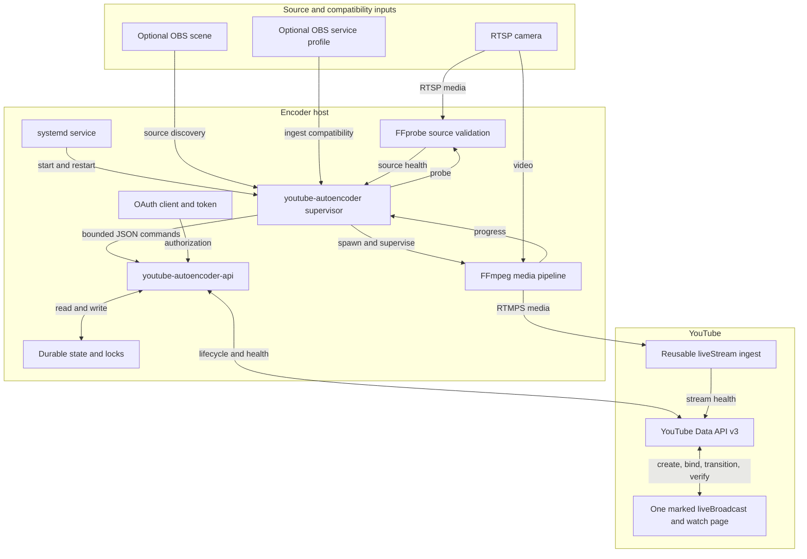
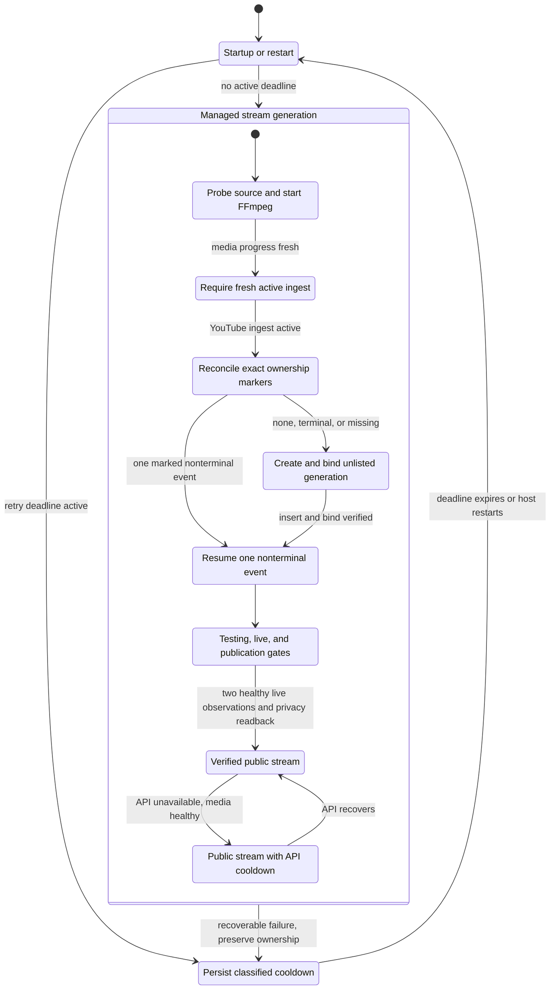
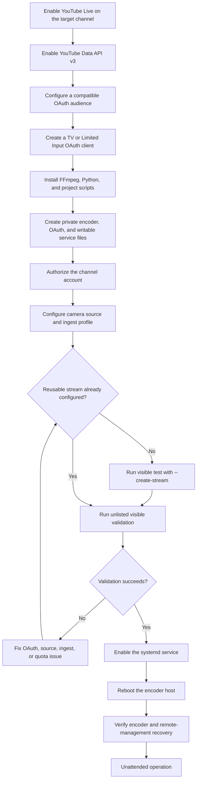

# README Linked Diagrams Implementation Plan

> **For agentic workers:** REQUIRED SUB-SKILL: Use superpowers:subagent-driven-development (recommended) or superpowers:executing-plans to implement this plan task-by-task. Steps use checkbox (`- [ ]`) syntax for tracking.

**Goal:** Move the README's three Mermaid diagrams to one linked documentation page without changing diagram content or surrounding operational guidance.

**Architecture:** `docs/architecture-and-flows.md` becomes the single visual reference and owns exactly three existing Mermaid blocks. `README.md` remains the executive and operator entry point, replacing each embedded block with a contextual deep link while retaining all tables, commands, OAuth guidance, caveats, and changelog content.

**Tech Stack:** GitHub-flavored Markdown, Mermaid, markdownlint-cli2, Ruff, pytest, Kroki-compatible Mermaid rendering, GitHub Actions.

## Global Constraints

- Create only one diagram page: `docs/architecture-and-flows.md`.
- Preserve all three Mermaid bodies byte-for-byte.
- Leave zero Mermaid fences in `README.md` and exactly three in the new page.
- Do not move or rewrite README tables, numbered flows, commands, OAuth provisioning, operations, caveats, or changelog content.
- Do not modify runtime code, configuration, tests, systemd units, release metadata, or historical design and implementation documents.
- Do not introduce generated image assets, diagram dependencies, credentials, or deployment-specific values.

---

### Task 1: Create The Dedicated Diagram Page

**Files:**

- Create: `docs/architecture-and-flows.md`
- Verify: `README.md`

**Interfaces:**

- Consumes: The three Mermaid bodies currently embedded in `README.md`, in architecture, recovery, deployment order.
- Produces: Stable headings `system-architecture`, `recovery-state-machine`, and `provisioning-and-deployment` for README deep links.

- [ ] **Step 1: Capture the current Mermaid bodies and hashes**

Run:

```bash
mkdir -p /tmp/yta-linked-diagrams
awk '
  /^```mermaid$/ {in_block=1; count++; next}
  /^```$/ && in_block {in_block=0; next}
  in_block {print > ("/tmp/yta-linked-diagrams/before-" count ".mmd")}
' README.md
for n in 1 2 3; do
  shasum -a 256 "/tmp/yta-linked-diagrams/before-$n.mmd"
done
```

Expected hashes, in order:

```text
7a2f8c8852733b5765a467a3b28be6f12dab4f89201698a71eacc071779949f1
aba3e3d9ef909192fbdf28d2503d79775d8b72efc4a552042c1c049f857aff07
f54dd8b4424caae4a8ee28d70f40fc38d1243c3c995c8bb9d1693f86da006a84
```

- [ ] **Step 2: Verify the new-page contract initially fails**

Run:

```bash
test ! -e docs/architecture-and-flows.md
```

Expected: exit 0 because the page does not exist yet.

- [ ] **Step 3: Create the page and move the exact diagram bodies**

Use `apply_patch` to create `docs/architecture-and-flows.md` with this framing and the exact captured bodies in order:

````markdown
# Architecture and Operational Flows

This page collects the project's visual system and operational flows. Use the [README](../README.md) for installation commands, configuration, failure details, OAuth provisioning, and operations.

For reconciliation algorithms, lifecycle invariants, and test strategy, see the [idempotent lifecycle recovery design](superpowers/specs/2026-07-10-idempotent-youtube-lifecycle-design.md).

## System Architecture

The encoder separates local media supervision from serialized YouTube lifecycle control.



Return to [Architecture](../README.md#architecture).

## Recovery State Machine

Recovery preserves ownership, retries through durable cooldowns, and replaces an event only after it is terminal or confirmed missing.



Return to [Recovery Behavior](../README.md#recovery-behavior).

## Provisioning and Deployment

Provisioning validates YouTube, OAuth, ingest, and media before enabling unattended service operation.



Return to [Installation](../README.md#installation).
````

The Mermaid bodies above are the exact captured contents. Insert them verbatim between the page's Mermaid fences.

- [ ] **Step 4: Prove all moved Mermaid bodies are unchanged**

Run:

```bash
awk '
  /^```mermaid$/ {in_block=1; count++; next}
  /^```$/ && in_block {in_block=0; next}
  in_block {print > ("/tmp/yta-linked-diagrams/after-" count ".mmd")}
' docs/architecture-and-flows.md
for n in 1 2 3; do
  cmp "/tmp/yta-linked-diagrams/before-$n.mmd" "/tmp/yta-linked-diagrams/after-$n.mmd"
done
test "$(rg -c '^```mermaid$' docs/architecture-and-flows.md)" -eq 3
```

Expected: all three `cmp` commands and the count assertion exit 0.

- [ ] **Step 5: Commit the dedicated page**

```bash
git add docs/architecture-and-flows.md
git commit -S -m "docs: move diagrams to architecture page"
```

### Task 2: Replace README Diagrams With Deep Links

**Files:**

- Modify: `README.md`
- Verify: `docs/architecture-and-flows.md`

**Interfaces:**

- Consumes: The three stable headings created in Task 1.
- Produces: Three contextual README links and a repository-layout entry for the diagram page.

- [ ] **Step 1: Verify the zero-embedded-diagram contract currently fails**

Run:

```bash
test "$(rg -c '^```mermaid$' README.md)" -eq 0
```

Expected: nonzero exit because the README still contains three Mermaid blocks.

- [ ] **Step 2: Replace the architecture diagram**

Remove the architecture Mermaid fence and body. Insert this sentence immediately after `## Architecture`:

```markdown
See the [system architecture diagram](docs/architecture-and-flows.md#system-architecture) for component boundaries and media/control data flows.
```

Keep the supervisor ownership paragraph, lifecycle-design link, component table, and persistent-state section unchanged.

- [ ] **Step 3: Replace the recovery state machine**

Remove the recovery Mermaid fence and body. After the existing recovery orienting paragraph, insert:

```markdown
See the [recovery state machine](docs/architecture-and-flows.md#recovery-state-machine) for startup, managed-generation, and durable-cooldown transitions.
```

Keep the failure table, backoff table, ownership-marker explanation, and test-pattern flow unchanged.

- [ ] **Step 4: Replace the deployment flow and register the page**

Remove the deployment Mermaid fence and body. After the existing installation orienting paragraph, insert:

```markdown
See the [provisioning and deployment flow](docs/architecture-and-flows.md#provisioning-and-deployment) for the end-to-end setup sequence.
```

Add this line to the README repository-layout block before `docs/raspberry-pi.md`:

```text
docs/architecture-and-flows.md       Architecture and operational flow diagrams
```

- [ ] **Step 5: Verify README links and diagram ownership**

Run:

```bash
test "$(rg -c '^```mermaid$' README.md || true)" -eq 0
test "$(rg -c '^```mermaid$' docs/architecture-and-flows.md)" -eq 3
rg -n 'docs/architecture-and-flows\.md#(system-architecture|recovery-state-machine|provisioning-and-deployment)' README.md
rg -n '^## (System Architecture|Recovery State Machine|Provisioning and Deployment)$' docs/architecture-and-flows.md
git diff --check
```

Expected: zero README diagrams, three dedicated-page diagrams, three README deep links, three matching headings, and no whitespace errors.

- [ ] **Step 6: Commit the README links**

```bash
git add README.md
git commit -S -m "docs: link README architecture diagrams"
```

### Task 3: Render And Verify The Documentation Move

**Files:**

- Verify: `README.md`
- Verify: `docs/architecture-and-flows.md`
- Verify: `docs/superpowers/specs/2026-07-10-readme-linked-diagrams-design.md`
- Verify: `docs/superpowers/plans/2026-07-10-readme-linked-diagrams.md`

**Interfaces:**

- Consumes: Final README and dedicated-page documentation from Tasks 1 and 2.
- Produces: Rendered-diagram evidence and a clean repository validation result.

- [ ] **Step 1: Extract and render the final diagram set**

Run:

```bash
awk '
  /^```mermaid$/ {in_block=1; count++; next}
  /^```$/ && in_block {in_block=0; next}
  in_block {print > ("/tmp/yta-linked-diagrams/final-" count ".mmd")}
' docs/architecture-and-flows.md
for n in 1 2 3; do
  curl -fsS -X POST -H 'Content-Type: text/plain' \
    --data-binary "@/tmp/yta-linked-diagrams/final-$n.mmd" \
    https://kroki.io/mermaid/svg \
    -o "/tmp/yta-linked-diagrams/final-$n.svg"
  test -s "/tmp/yta-linked-diagrams/final-$n.svg"
  rg -q '<svg' "/tmp/yta-linked-diagrams/final-$n.svg"
done
```

Expected: three nonempty SVG files containing `<svg`.

- [ ] **Step 2: Run documentation and repository checks**

Run:

```bash
npm_config_cache=/tmp/yta-readme-npm-cache npx --yes markdownlint-cli2 $(git ls-files '*.md')
/tmp/yta-readme-baseline-venv/bin/ruff check .
/tmp/yta-readme-baseline-venv/bin/python -m py_compile \
  bin/youtube-autoencoder bin/youtube-autoencoder-api bin/youtube-autoencoder-test-pattern
/tmp/yta-readme-baseline-venv/bin/python -m pytest -q
test -x bin/youtube-autoencoder
test -x bin/youtube-autoencoder-api
test -x bin/youtube-autoencoder-test-pattern
git diff --check origin/main...HEAD
```

Expected: zero Markdown or Ruff errors, successful compilation and executable checks, 89 passing tests, and no diff errors.

- [ ] **Step 3: Verify scope and secret hygiene**

Run:

```bash
git diff --name-only origin/main...HEAD | sort
if git diff origin/main...HEAD -- README.md docs/architecture-and-flows.md \
  | rg -i 'rtsp://[^<]|stream[_ -]?key\s*=|refresh[_ -]?token\s*='; then
  exit 1
fi
```

Expected changed files:

```text
README.md
docs/architecture-and-flows.md
docs/superpowers/plans/2026-07-10-readme-linked-diagrams.md
docs/superpowers/specs/2026-07-10-readme-linked-diagrams-design.md
```

Expected: no credential-assignment pattern in the public documentation diff.

- [ ] **Step 4: Commit any verification-only corrections**

If rendering or linting required documentation corrections, commit only those corrections:

```bash
git add README.md docs/architecture-and-flows.md docs/superpowers/plans/2026-07-10-readme-linked-diagrams.md docs/superpowers/specs/2026-07-10-readme-linked-diagrams-design.md
git commit -S -m "docs: finalize linked diagram navigation"
```

If no files changed, skip this commit.

### Task 4: Publish, Review, And Merge

**Files:**

- Publish: branch `codex/readme-linked-diagrams`
- Review: pull request into `main`

**Interfaces:**

- Consumes: Verified signed commits from Tasks 1 through 3.
- Produces: A reviewed squash merge on `main` with passing required and post-merge checks.

- [ ] **Step 1: Push and create the pull request**

Create `/tmp/yta-linked-diagrams-pr-body.md` with:

```markdown
## Summary

- move all three Mermaid diagrams from the README to one architecture and operational flows page
- replace embedded README diagrams with contextual deep links
- preserve the reviewed Mermaid bodies and all operational, OAuth, caveat, and changelog content

## Impact

Documentation only. Runtime code, configuration, services, API behavior, and release metadata are unchanged.

## Validation

- all three Mermaid bodies match their pre-move SHA-256 hashes
- three SVG renders generated successfully
- tracked Markdown lint passed
- Ruff, Python compilation, executable checks, and 89 tests passed
- secret-pattern and diff-scope checks passed

## Review Focus

- README links resolve to the intended headings
- the dedicated page contains the unchanged diagrams in architecture, recovery, deployment order
- no operational guidance was removed from the README
```

Then run:

```bash
git push -u origin codex/readme-linked-diagrams
pr_url="$(gh pr create --repo sumitake/YouTube-AutoEncoder \
  --base main \
  --head codex/readme-linked-diagrams \
  --title "docs: link README architecture diagrams" \
  --body-file /tmp/yta-linked-diagrams-pr-body.md)"
pr_number="${pr_url##*/}"
printf '%s\n' "$pr_number" > /tmp/yta-linked-diagrams-pr-number
```

Expected: `pr_url` identifies a new pull request and its number is stored for later commands.

- [ ] **Step 2: Complete review and CI gates**

Run:

```bash
pr_number="$(cat /tmp/yta-linked-diagrams-pr-number)"
gh pr checks "$pr_number" --repo sumitake/YouTube-AutoEncoder --watch --interval 10
gh api --paginate "repos/sumitake/YouTube-AutoEncoder/pulls/$pr_number/comments"
```

Address every actionable comment, rerun local validation after changes, resolve all threads, and confirm the final head is signed and current with `main`.

- [ ] **Step 3: Squash merge the exact reviewed head**

Run:

```bash
pr_number="$(cat /tmp/yta-linked-diagrams-pr-number)"
final_sha="$(git rev-parse HEAD)"
gh pr merge "$pr_number" --repo sumitake/YouTube-AutoEncoder \
  --squash --admin --delete-branch --match-head-commit "$final_sha"
```

Expected: PR state becomes `MERGED` and reports a merge commit on `main`.

- [ ] **Step 4: Verify the merged result**

Run:

```bash
pr_number="$(cat /tmp/yta-linked-diagrams-pr-number)"
merge_sha="$(gh pr view "$pr_number" --repo sumitake/YouTube-AutoEncoder --json mergeCommit --jq .mergeCommit.oid)"
git -C /Users/josumi/Documents/Codex/YouTube-AutoEncoder pull --ff-only origin main
test "$(git -C /Users/josumi/Documents/Codex/YouTube-AutoEncoder rev-parse HEAD)" = "$merge_sha"
cd /Users/josumi/Documents/Codex/YouTube-AutoEncoder
npm_config_cache=/tmp/yta-readme-npm-cache npx --yes markdownlint-cli2 $(git ls-files '*.md')
/tmp/yta-readme-baseline-venv/bin/ruff check .
/tmp/yta-readme-baseline-venv/bin/python -m pytest -q
gh run list --repo sumitake/YouTube-AutoEncoder --commit "$merge_sha" \
  --json name,status,conclusion,headSha,url
```

Expected: the primary clone points to the merge SHA, local lint and 89 tests pass, and the CI, CodeQL, and Secret Scan runs all complete successfully for that SHA.
