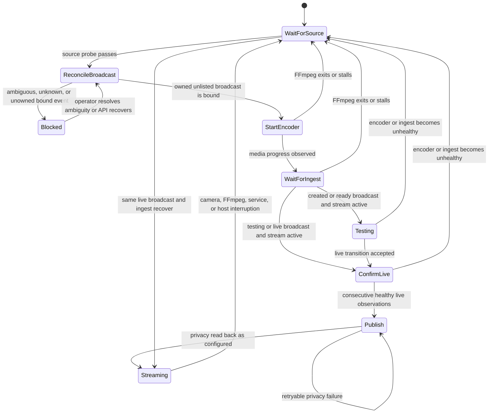

# Idempotent YouTube Lifecycle Recovery Design

Date: 2026-07-10
Updated: 2026-07-11

## Summary

YouTube AutoEncoder will manage one event-specific YouTube broadcast at a time and preserve that broadcast's watch URL across camera, FFmpeg, service, and Raspberry Pi restarts whenever YouTube still considers the event nonterminal. A replacement broadcast will be created only after the previous event is confirmed `complete`, `revoked`, or missing.

New broadcasts will be created as unlisted. The service will promote a broadcast to public only after FFmpeg is producing media, YouTube reports active and acceptably healthy ingest, and YouTube confirms that the broadcast lifecycle is live. Recovery attempts must not create duplicate scheduled broadcasts or consume API quota in a tight loop.

## Failure Evidence

The design is based on direct observation of the current Raspberry Pi deployment:

- The configured camera is reachable. FFprobe reports H.264 Main video at 2688x1520 and approximately 20 fps.
- Raspberry Pi FFmpeg 5.1.9 rejects the deployed input option with `Option rw_timeout not found` and exits immediately.
- A later unmarked legacy event auto-started on ingest and auto-stopped seven seconds later when an insert throttle caused the supervisor to terminate FFmpeg.
- Repeated `liveBroadcasts.insert` attempts returned `User requests exceed the rate limit.`; read-only stream and broadcast inventory calls continued to succeed.
- The same camera-to-local-FLV command succeeds when `-rw_timeout` is removed.
- The supervisor waits up to 180 seconds in a synchronous YouTube helper while the FFmpeg child has already exited. It does not drain or inspect the child during this wait.
- Every retry creates and binds another event before FFmpeg is proven viable.
- Attempts to complete pre-live broadcasts fail, leaving scheduled events behind.
- The loop eventually receives `userRequestsExceedRateLimit`, then retries again after ten seconds.

## Goals

- Recover automatically after camera loss, FFmpeg failure, network interruption, service restart, and Pi reboot.
- Preserve the current broadcast ID and watch URL while its YouTube lifecycle remains recoverable.
- Create at most one managed broadcast for one lifecycle generation.
- Never create a broadcast before the encoder has established active YouTube ingest.
- Keep new broadcasts unlisted until live state and ingest health are confirmed.
- Promote the Pi deployment to public visibility after that confirmation.
- Stop API hammering through bounded polling and persisted backoff.
- Detect FFmpeg exit and stalled media while waiting on YouTube.
- Keep copy mode as the low-resource default when YouTube accepts its output.
- Recover after hard power loss while durable state remains intact, and fail closed rather than duplicate when marker-free state is lost.
- Preserve existing unrelated or ambiguous YouTube resources unless cleanup is explicitly authorized.

## Non-Goals

- Automatically deleting or completing the existing duplicate scheduled broadcasts.
- Reusing a broadcast after YouTube has made it terminal.
- Guaranteeing archival of an indefinitely running broadcast. YouTube may not archive streams longer than its supported archive window.
- Automatically switching from copy mode to transcoding without runtime evidence and an explicit deployment configuration change.
- Providing high availability through a second encoder or backup ingest endpoint.
- Replacing Raspberry Pi Connect, the VS Code Remote Tunnel, or systemd as the management and service layers.

## YouTube Constraints

- A `liveStream` is reusable; an event-specific `liveBroadcast` is single-use.
- YouTube requires the bound stream to report `status.streamStatus=active` before transitions to `testing` or `live`.
- A broadcast that reaches `live` cannot return to `testing`, `ready`, or a scheduled state.
- Broadcast privacy can be updated independently from lifecycle state.
- `enableAutoStop` is unsuitable for this deployment because YouTube can end a broadcast shortly after ingest stops.

References:

- [Life of a Broadcast](https://developers.google.com/youtube/v3/live/life-of-a-broadcast)
- [LiveBroadcasts resource](https://developers.google.com/youtube/v3/live/docs/liveBroadcasts)
- [LiveStreams resource](https://developers.google.com/youtube/v3/live/docs/liveStreams)
- [LiveBroadcasts update](https://developers.google.com/youtube/v3/live/docs/liveBroadcasts/update)

## Architecture

### Supervisor

`youtube-autoencoder` owns local runtime behavior:

- Source discovery and source probing.
- FFmpeg capability checks and argument construction.
- FFmpeg process, log, and media-progress supervision.
- State-machine timing and bounded YouTube polling.
- Failure classification and retry scheduling.
- A process-lifetime single-instance lock.

### API Helper

`youtube-autoencoder-api` owns YouTube resource behavior:

- OAuth token refresh and API requests.
- Reusable stream lookup or creation.
- Broadcast lookup, exact ownership matching, creation, and binding.
- Lifecycle transition and privacy update operations.
- Durable local recovery-cache writes.
- A bounded mutation lock shared by all mutating CLI commands.
- Structured API errors that the supervisor can classify without parsing tracebacks.

### Source Of Truth

YouTube is authoritative for stream and broadcast lifecycle. The private local state file is the durable ownership record and recovery cache; it cannot override remote lifecycle or stream binding.

On every startup and before every mutation, the helper validates local IDs against YouTube. A missing, corrupt, or stale state file triggers remote reconciliation before any create operation.

## Managed Identity

A stable `YTA_INSTANCE_ID` identifies one encoder deployment. The Pi will use `rpi5-streamer`; a generic installation may default to a sanitized hostname but should set an explicit value for durable identity.

Schema v3 never sets or updates YouTube `liveBroadcast` or `liveStream` descriptions. The exact broadcast ID in the mode-0600 state file is the normal ownership proof. A scoped schema-v2 state with an ID migrates by fetching and validating that exact resource; legacy description markers are read only when an interrupted schema-v2 create or missing state must be reconciled.

Before a new insert, the helper creates a local generation UUID and durably records title, whole-second scheduled start, staging privacy, reusable stream ID, and creation-intent time. It fsyncs `pending_action=verify_create` before the network call. If the response is lost, recovery lists active and upcoming events and may adopt exactly one candidate matching the normalized fingerprint, expected content settings, compatible binding, and bounded publication window. Zero or multiple matches remain blocked and never authorize another insert.

Title matching alone is never sufficient. When state is missing, any recoverable same-stream or unbound same-title event blocks creation unless one exact legacy marker candidate can be migrated.

## Lifecycle State Machine



### Recoverable Broadcast States

- `created`: finish binding and wait for `ready`.
- `ready`: transition through `testing` and `live` after health gates.
- `testStarting`: poll to a stable state without creating another event.
- `testing`: revalidate ingest and transition to `live`.
- `liveStarting`: poll to a stable state without creating another event.
- `live`: resume ingest and preserve the event.

### Terminal States

- `complete`
- `revoked`
- A confirmed missing broadcast ID

Only a terminal state permits a new broadcast generation. Unknown lifecycle values fail closed: log the state, apply backoff, and do not create.

## Reconciliation Algorithm

1. Resolve the reusable stream and its stream ID.
2. Read the local cache. If it is malformed, rename it to a timestamped `.corrupt` file and continue without trusting it.
3. If the cache contains a broadcast ID, fetch that broadcast by ID.
4. Verify the exact cached ID, stream relationship, and lifecycle without reading its description.
5. List active and upcoming event broadcasts before starting FFmpeg and block conflicting resources bound to the reusable stream.
6. For schema-v2 migration only, adopt exactly one compatible candidate with exact legacy instance and generation markers.
7. If schema-v3 state is `verify_create`, filter by the persisted normalized fingerprint and adopt exactly one match; zero or multiple matches remain blocked.
8. If safe creation is permitted, generate or retain one local generation and durably persist the required insert fields with `pending_action=create`.
9. Fsync `pending_action=verify_create` before calling `liveBroadcasts.insert` without a description field.
10. Restore `pending_action=create` only after an explicit non-5xx rejection other than HTTP 408. Timeouts, HTTP 408, 5xx responses, malformed success responses, or process death remain verification-only.
11. Persist the returned broadcast ID immediately, marking binding as pending.
12. Bind it to the reusable stream, persist the updated state, and only then permit FFmpeg ingest to start.
13. Require fresh active ingest before `testing` or `live`, and repeat remote validation before every subsequent mutation.

An uncertain insert is polled indefinitely through persisted ambiguous backoff, capped at one hour between attempts. It never becomes eligible for another automatic insert. This is the no-duplicate tradeoff required because YouTube exposes no documented idempotency key or private application metadata field.

## Transition And Publication Gates

Immediately before transitions to `testing` and `live`, the supervisor must confirm:

- FFmpeg is running.
- FFmpeg has made media progress within the configured watchdog interval.
- The YouTube stream reports `streamStatus=active`.

Immediately after each transition, the supervisor reads the remote broadcast state again. This cannot eliminate the network race between the final check and YouTube accepting a transition, but it prevents a newly-live unhealthy event from being promoted to public.

Public promotion requires two consecutive observations, separated by the normal poll interval, where:

- FFmpeg remains alive and progressing.
- `liveStream.status.streamStatus` is `active`.
- `liveStream.status.healthStatus.status` is `good` or `ok`.
- `liveBroadcast.status.lifeCycleStatus` is `live`.

New events use `YTA_YOUTUBE_STAGING_PRIVACY=unlisted`. After the gate passes, the helper fetches the current broadcast resource, preserves the fields required by `liveBroadcasts.update`, sets `status.privacyStatus` to `YTA_YOUTUBE_LIVE_PRIVACY`, and reads the broadcast back. The Pi deployment sets final privacy to `public`.

If promotion fails, the event remains live and unlisted. Retries perform only reconciliation and privacy update; they do not create or retransition the broadcast.

An already-public live broadcast is never demoted during recovery. A later camera outage may leave its watch page public but temporarily unavailable. This is intentional because preserving the watch URL is the primary recovery policy.

## FFmpeg Supervision

### Option Compatibility

- Remove `-rw_timeout` from FFmpeg's default RTSP arguments.
- Probe `ffmpeg -hide_banner -h demuxer=rtsp` once at process startup with a short subprocess timeout.
- Include RTSP `-timeout` only when the deployed binary advertises it.
- Keep the external progress watchdog as the version-independent hang detector.
- FFprobe options remain independently capability-tested because FFprobe and FFmpeg can expose different option sets in the same package.

### Media Progress

FFmpeg will emit machine-readable progress at a bounded interval. The supervisor updates a monotonic last-progress timestamp from output-time or frame progress and continues to drain normal redacted logs.

If FFmpeg is alive but does not report media progress within `YTA_FFMPEG_PROGRESS_TIMEOUT_SEC`, the supervisor sends SIGINT, waits for graceful exit, then kills the process if required. No YouTube transition or public promotion occurs while progress is stale; the single staged unlisted event remains available for recovery.

### Copy Mode

Copy mode remains the initial deployment mode because it minimizes Pi CPU use. The observed camera generates timestamp warnings in local FLV output, so the live rollout must verify YouTube stream health before public promotion. If YouTube reports persistent timestamp, codec, frame-rate, or bitrate errors, the rollout stops at unlisted and gathers evidence before changing the configured mode to a tested hardware or software transcode path.

## Failure Recovery

### Before Live

If camera, FFmpeg, or ingest fails before `live`, retain the single managed broadcast as unlisted and nonterminal. Stop the failed FFmpeg process, apply source/encoder backoff, and reuse the same broadcast on recovery.

### Live But Not Public

If health fails after transition to live but before publication, retain the same live unlisted broadcast. Resume ingest and repeat the publication gate after recovery.

### Live And Public

If camera, FFmpeg, service, or Pi fails after publication, do not complete or replace the broadcast. Restart FFmpeg when the source returns and resume the same stream and event.

### API Failure During Stable Streaming

Every new FFmpeg session requires successful pre-ingest ownership and binding reconciliation, even when the cache says the prior event was live and public. An API timeout or rate-limit error before FFmpeg starts therefore fails closed under persisted backoff. After that reconciliation succeeds and healthy public ingest is already active, a later API failure does not stop FFmpeg; nonessential API calls pause until backoff expires and mutations remain disabled until remote state can be reconciled.

### Explicit Completion

Camera loss, FFmpeg exit, SIGTERM, service restart, package upgrade, and Pi reboot never complete a broadcast. Only an explicit operator lifecycle command may transition it to `complete`. That command acquires the same mutation lock and confirms the target ID and current lifecycle first.

## Retry And Quota Controls

Retries use full jitter and persist their class, attempt count, and next eligible time in the durable cache.

| Failure class | Initial delay | Maximum delay | Behavior |
| --- | ---: | ---: | --- |
| Source or FFmpeg | 10 seconds | 5 minutes | Reset after sustained media progress |
| Transient API/network/5xx | 30 seconds | 15 minutes | Honor a longer `Retry-After` value |
| Rate limit or quota | 15 minutes | 6 hours | No lifecycle mutation before expiry |
| Ambiguous/unknown state | 5 minutes | 1 hour | Never create while ambiguity remains |

Additional controls:

- Poll at five-second intervals only during bounded transitions.
- Cap one transition wait at the configured timeout, initially 180 seconds.
- Stop nonessential periodic polling after the event is stable and public.
- Reconcile before every insert, including after an unknown insert response.
- Never retry `insert` solely because a subsequent bind or transition failed.
- Persist cooldowns so rebooting cannot reset a quota circuit breaker.

## Concurrency And Durability

### Supervisor Lock

The supervisor holds a nonblocking process-lifetime lock in the service user's config directory. A duplicate systemd instance fails fast with a clear message and performs no API operation.

### Mutation Lock

The API helper uses an exclusive lock for create, bind, transition, privacy update, and complete operations. Lock acquisition has a bounded timeout and reports the holder when available. Read-only status commands do not hold the mutation lock. Emergency mutation still requires serialization; it must not bypass the lock and race the supervisor.

### Durable Cache Writes

Each state update uses:

1. A temporary file in the target directory.
2. File flush and `fsync`.
3. Permission mode `0600`.
4. Atomic rename over the state file.
5. Parent-directory `fsync`.

A hard power loss should therefore leave either the previous valid file or the new valid file on a normal local filesystem. A malformed file is quarantined rather than causing a crash loop. Remote reconciliation remains mandatory even when the cache parses correctly.

## State Cache

The versioned JSON cache records only recovery metadata:

```json
{
  "schema_version": 2,
  "instance_id": "rpi5-streamer",
  "generation_id": "7ecbc64c-c31c-4f4d-952b-4bfd70e3ce36",
  "stream_id": "youtube-stream-id",
  "broadcast_id": "youtube-broadcast-id",
  "pending_action": null,
  "last_known_lifecycle": "live",
  "last_known_privacy": "public",
  "retry_class": null,
  "retry_attempt": 0,
  "retry_not_before": null,
  "updated_at": "2026-07-10T00:00:00Z"
}
```

The cache does not store the stream key, OAuth client secret, access token, or refresh token.

## Error Contract And Logging

The API helper returns structured failure details containing:

- HTTP status when available.
- YouTube error reason values.
- Retryability classification.
- `Retry-After` when present.
- A redacted human-readable message.

The supervisor must not classify behavior from a Python traceback. Logs include API operation, HTTP status, structured reason, lifecycle transitions, retry class, cooldown time, stream health, broadcast ID, and watch URL. Camera credentials, OAuth material, and stream keys remain redacted.

The systemd service continues to run as the dedicated unprivileged user. Root is needed only to install files and manage the system unit.

## Configuration Changes

The implementation adds or formalizes:

- `YTA_INSTANCE_ID`
- `YTA_YOUTUBE_STAGING_PRIVACY=unlisted`
- `YTA_YOUTUBE_LIVE_PRIVACY=public` for this Pi
- `YTA_FFMPEG_PROGRESS_TIMEOUT_SEC`
- `YTA_YOUTUBE_POLL_INTERVAL_SEC=5`
- Retry base and maximum values for source, API, quota, and ambiguous-state classes
- Mutation-lock timeout

`YTA_YOUTUBE_COMPLETE_ON_EXIT` is deprecated and disabled for unattended lifecycle mode. Explicit `complete` remains available.

## Test Strategy

### Unit Tests

- FFmpeg arguments omit unsupported `-rw_timeout`.
- Capability checks include or omit `-timeout` correctly and time out safely.
- Source failure performs no YouTube broadcast operation.
- One description-neutral unlisted broadcast is staged and bound before FFmpeg starts.
- An unowned recoverable event bound to the reusable stream blocks before ingest.
- FFmpeg exit before active ingest retains the staged event and performs no transition.
- Stale media progress terminates FFmpeg and blocks lifecycle mutation.
- Cached `created`, `ready`, `testStarting`, `testing`, `liveStarting`, and `live` broadcasts are reused.
- `complete`, `revoked`, or confirmed missing broadcasts permit one replacement.
- Unknown lifecycle values block creation.
- A schema-v3 create fingerprint is durable before insert, and a lost response enters verification-only recovery without reinserting.
- Explicit insert rejection can retry with a fresh future start time, while ambiguous failure retains `verify_create`; bind failure retries the same broadcast ID.
- A crash after insert and before bind resumes binding the same ID.
- Multiple exact fingerprint or legacy-marker matches block automatic adoption and insertion.
- Both live-stream and broadcast insert payloads omit the description key, and privacy updates remain status-only.
- Unrelated title-prefix matches are ignored.
- Child and ingest health are checked before each transition.
- Child failure after live transition but before publication cannot publish the event.
- Public promotion requires consecutive healthy live observations and readback.
- Publication failure retries privacy only.
- FFmpeg, SIGTERM, service restart, and simulated reboot paths never call complete.
- Retry backoff, jitter bounds, `Retry-After`, and persisted cooldown behavior are deterministic under a fake clock.
- Corrupt cache is quarantined and remote reconciliation proceeds.
- Supervisor and mutation locks prevent concurrent writers without blocking read-only status.

### Local Integration Tests

- Run the supervisor against fake API and FFmpeg subprocesses to exercise process/API interleavings.
- Verify logs remain redacted under structured API and FFmpeg failures.
- Run the existing Pytest and Ruff suites.

### Raspberry Pi Preflight

- Stop the current service before any other remote mutation.
- Confirm no encoder process remains.
- Back up deployed binaries, systemd unit, private environment file, OBS compatibility files, and lifecycle cache with root-only or service-user-only permissions.
- Record systemd enabled state, Pi remote-management service state, and current binary hashes.
- Validate the exact camera-to-local-output FFmpeg path long enough to exercise progress and timeout behavior.
- Query and record active/upcoming broadcasts when quota permits, without cleanup.

### YouTube End-To-End Verification

1. Start the merged service with staging privacy unlisted and final privacy public.
2. Confirm FFmpeg remains alive and reports media progress.
3. Confirm exactly one managed broadcast is selected or created.
4. Confirm the reusable stream becomes active with `good` or `ok` health.
5. Confirm the broadcast becomes live while still unlisted.
6. Confirm the service changes privacy to public and reads it back.
7. Record the broadcast ID and watch URL.
8. Kill FFmpeg and prove the same broadcast ID returns to healthy live streaming.
9. Restart the systemd service and prove the same broadcast ID returns again.
10. Confirm no additional broadcast was created and the scheduled-event count did not increase during either recovery test.
11. Confirm the service is enabled and Raspberry Pi Connect and the VS Code Remote Tunnel remain operational.

## Deployment Flow

1. Implement in an isolated branch with tests first.
2. Run local tests, Ruff, secret scanning, and repository CI.
3. Obtain independent code review focused on state transitions, races, quota behavior, and secrets.
4. Open the authorized PR, resolve review findings, wait for required checks, and self-merge.
5. Stop the current Pi service to contain the existing retry loop.
6. Capture backups and pre-deployment state.
7. Install only the merged scripts, example/runtime configuration changes, and systemd unit if changed.
8. Run Pi-local preflight before enabling YouTube mutations.
9. Start the service and execute the end-to-end verification above.
10. Leave existing duplicate broadcasts untouched and report a separate cleanup inventory.

## Rollback

If local runtime verification fails before transition to live:

- Stop the service.
- Restore the backed-up binaries, unit, and configuration.
- Restore or preserve the lifecycle cache according to the remotely observed broadcast state.
- Keep the staged event unlisted and nonterminal.

If failure occurs after transition to live but before publication:

- Keep or return privacy to unlisted.
- Restore the runtime if needed.
- Resume or explicitly complete that event; it cannot return to scheduled.

If failure occurs after publication:

- Change privacy back to unlisted if exposure must be withdrawn.
- Restore the runtime and resume the same event, or explicitly complete it.
- Never create a replacement until YouTube confirms the previous event is terminal.

The rollback procedure will be exercised for local files and systemd before final success is declared. The irreversible YouTube lifecycle constraint is documented rather than represented as reversible.

## Existing Duplicate Broadcasts

The repair will inventory active and upcoming broadcasts after the service is stopped. It will report IDs, titles, lifecycle states, privacy, scheduled times, and bound stream IDs without exposing secrets.

Schema-v3 exact-ID state and conservative conflict checks prevent legacy duplicates from being adopted accidentally. Static duplicates do not themselves spend request quota, but they may clutter YouTube Studio or interfere with stream binding. Completing, unbinding, privatizing, deleting, or changing their descriptions is a separate external mutation that requires an explicit cleanup decision based on the inventory.

## Acceptance Criteria

- The deployed FFmpeg command runs against the connected camera without an unsupported-option exit.
- No broadcast is created when the source, FFmpeg, or ingest readiness gate fails.
- One managed broadcast reaches live and then public visibility.
- FFmpeg and service restart tests preserve the same broadcast ID and watch URL.
- No recovery test increases the number of managed scheduled broadcasts.
- API rate-limit errors produce persisted cooldown rather than ten-second retries.
- Power-loss recovery preserves the exact broadcast ID when state survives and fails closed without duplicate creation when marker-free state is lost.
- The service remains enabled under systemd and remote-management services remain available.
- Existing legacy duplicates are reported but unchanged.

## Independent Review Adjudication

Two Antigravity/Gemini architecture reviews were run at high effort.

The first review identified local-state durability, transition races, FFmpeg option skew, and API polling as the highest risks. The design changed materially to make YouTube authoritative, add fsync-backed cache writes, add child/progress and ingest rechecks before every mutation, and gate public visibility after live confirmation.

The revised review rated the architecture high confidence and raised residual concerns about quota consumption, corrupt cache handling, duplicate service instances, and operator lock contention. The design therefore adds bounded transition polling, persisted quota cooldowns, corrupt-cache quarantine, a process-lifetime supervisor lock, and bounded mutation-lock acquisition.

One residual race remains unavoidable: FFmpeg or the network can fail after a pre-transition check but before YouTube accepts the transition. The control is to stage unlisted, immediately recheck after transitions, and require consecutive healthy live observations before public promotion. This risk is accepted because YouTube lifecycle transitions are irreversible and the user requires unattended lifecycle management.
